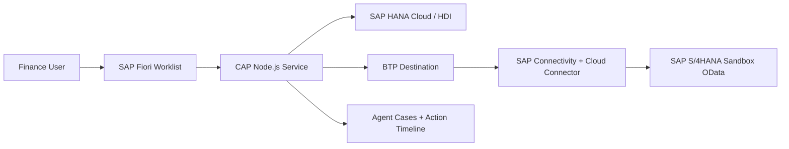

# SAP Supplier Invoice Resolution Agent

An agentic AI-style SAP application built with SAP CAP, SAP Fiori elements, SAP BTP, SAP HANA Cloud, Destination service, Connectivity service, and SAP Cloud Connector.

The agent helps finance/AP teams detect supplier invoice exceptions, explain the reason, recommend the next action, create an agent case, record an action timeline, and support approval/release handling.

## What It Does

- Shows supplier invoices in a SAP Fiori worklist.
- Connects to SAP S/4HANA through BTP Destination and Cloud Connector.
- Synchronizes supplier invoice data from S/4HANA OData.
- Detects invoice issues such as missing goods receipt, price variance, duplicate invoice risk, manual block, and approval-required cases.
- Creates agent cases with risk level, confidence, explanation, and recommended action.
- Records an action timeline so users can see what the agent decided and did.

## Why It Is Agentic AI

This is not only a report. The application follows an agent flow:

1. **Detect** blocked or risky supplier invoices.
2. **Analyze** invoice, PO, quantity, price, duplicate, and approval data.
3. **Decide** the correct business action.
4. **Act** by creating cases, recommendations, simulated corrections, approval steps, and release actions.
5. **Track** every action in a timeline for auditability.

## Architecture



## Main Folders

| Folder/File | Purpose |
|---|---|
| `app/invoiceworklist` | SAP Fiori elements UI |
| `db/schema.cds` | CAP data model for invoices, cases, actions, sync runs |
| `db/data/invoice.agent-Invoices.csv` | Local demo/test invoice data |
| `srv/invoice-agent-service.cds` | CAP service definition and actions |
| `srv/invoice-agent-service.js` | Agent logic and action handlers |
| `srv/lib/s4-supplier-invoice.js` | S/4HANA OData client |
| `srv/lib/s4-invoice-sync.js` | S/4HANA invoice sync mapping |
| `mta.yaml` | BTP Cloud Foundry deployment descriptor |
| `xs-security.json` | XSUAA security descriptor |

## Screenshots

Add screenshots in `docs/screenshots/`:

- `01-fiori-invoice-list.png`
- `02-invoice-object-page.png`
- `03-agent-run-success.png`
- `04-agent-case-timeline.png`
- `05-s4-sync-success.png`
- `06-btp-cf-apps-running.png`
- `07-hana-cloud-running.png`
- `08-cloud-connector-reachable.png`
- `09-project-structure-bas.png`

## Local Run

```bash
npm install
cds watch
```

## Deployment

The app is deployable to SAP BTP Cloud Foundry as an MTA archive.

```bash
mbt build
cf deploy mta_archives/sap-invoice-resolution-agent_1.0.0.mtar
```

Required BTP services:

- SAP HANA Cloud / HDI container
- XSUAA
- Destination service
- Connectivity service
- HTML5 Apps Repository
- Application Router

## Real SAP Integration

The project uses a BTP destination named `S4H_SANDBOX` to reach SAP S/4HANA OData through SAP Cloud Connector.

The S/4HANA sync maps fields such as supplier, invoice reference, posting date, document date, payment blocking reason, invoice status, and purchase-order reference items into the CAP model.

## Status

This repository contains the deployable source code for the Supplier Invoice Resolution Agent built in SAP BTP trial.
